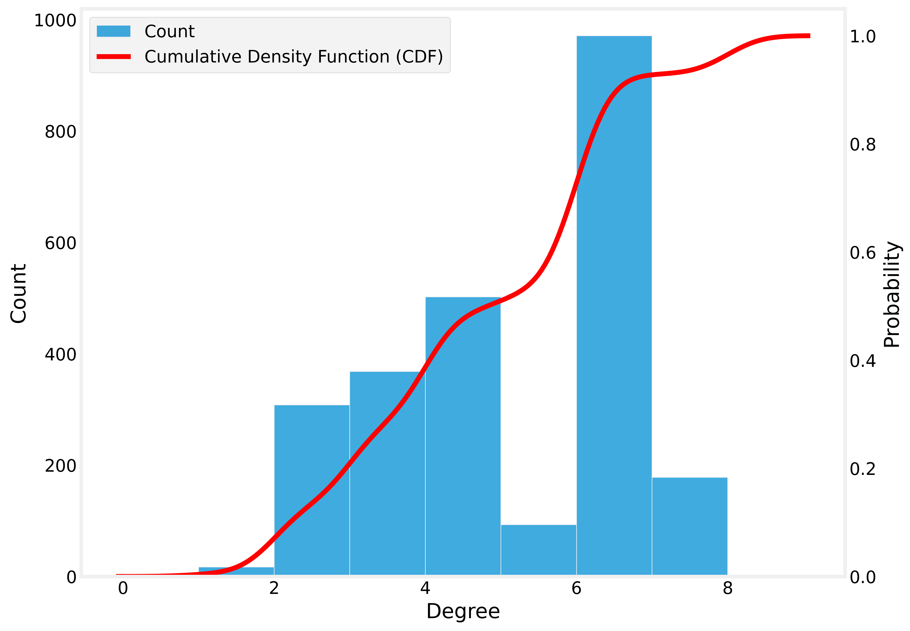

# Unit 01 Task 02
> Federal University of Rio Grande do Norte  
> Technology Center  
> Department of Computer Engineering and Automation  
> Course: **Algorithms and Data Structure II (DCA3702)**  
> Author: **Augusto Matheus Pinheiro Damasceno**  
> Contact
> [augustodamasceno@protonmail.com](mailto:augustodamasceno@protonmail.com)
>
> Copyright (c) 2024, Augusto Damasceno.  
> All rights reserved.   
> SPDX-License-Identifier: BSD-2-Clause

# Abstract

The project focuses on evaluating mobility around the Federal University of Rio Grande do Norte (UFRN) in Natal, RN.
The analysis includes identifying ideal locations for bike-sharing dock stations using network centrality metrics. 
It leverages degree, closeness, betweenness, and eigenvector centrality to determine optimal points in the network. 
Additionally, the study requires examining the CDF and PDF of node degrees, performing multivariate centrality 
metric analysis, and identifying the network’s core structure. 

# Video Presentation

The project will be presented in a video, where we will explore our approach to evaluating mobility around UFRN in Natal-RN.
In the video, we will cover the centrality metrics used, the analysis of node degree distributions (CDF and PDF), 
the multivariate analysis of centrality metrics, and the identification of the network's core structure. 
This presentation will highlight key findings and insights derived from the study, providing a comprehensive overview 
of our methodology and results. Watch the full explanation and walkthrough 
of the process on YouTube: [YouTube Link].

# Reproduction

Notebook `u1t5.ipynb`.

# Boundaries Natal-RN

# Natal-RN Graph

# Trim Map Around UFRN - 4 KM  
> Google Maps URL https://maps.app.goo.gl/9Vkd2y5ge2Bkqm7o7  

# Degree Centrality

Min Degree = 4.177458434288579e-05 and Max Degree = 0.0005012950121146295

# Closeness centrality
Min Closeness Degree = 0.0 from 501810397 and Max Closeness Degree = 0.03930471155464313 from 502723701

# Betweenness Centrality

# Eigenvector Centrality

# Probability Density Function

# Cumulative Density Function

# Multivariate Analysis 

# Best Locations

1. IVANOVITCHM. **DataStructure**. GitHub repository. Available at: <https://github.com/ivanovitchm/datastructure>. Accessed on: 08 Oct. 2024.

2. COSCIA, Michele. **The Atlas For The Aspiring Network Scientist**. 1st ed. 2021. Copyright © 2021 Michele Coscia. Available at: <https://www.networkatlas.eu>. Accessed on: 08 Oct. 2024.

3. PYTHON. Python.org. Available at: <https://www.python.org/>. Accessed on: 08 Oct. 2024.

4. PIP. Pip - Getting Started. Available at: <https://pip.pypa.io/en/stable/getting-started/>. Accessed on: 08 Oct. 2024.

5. NUMPY. NumPy - The fundamental package for array computing with Python. Available at: <https://numpy.org/>. Accessed on: 08 Oct. 2024.

6. PANDAS. Pandas - Python Data Analysis Library. Available at: <https://pandas.pydata.org/>. Accessed on: 08 Oct. 2024.

7. JUPYTER. Jupyter - Project Jupyter. Available at: <https://jupyter.org/>. Accessed on: 08 Oct. 2024.

8. **Python Standard Library - `random` module**  
   PYTHON SOFTWARE FOUNDATION. Python 3.10 Documentation: Random — Generate pseudo-random numbers. Available at: <https://docs.python.org/3/library/random.html>. Accessed on: 08 Oct. 2024.

9. **Python Standard Library - `enum` module**  
   PYTHON SOFTWARE FOUNDATION. Python 3.10 Documentation: Enum — Support for enumerations. Available at: <https://docs.python.org/3/library/enum.html>. Accessed on: 08 Oct. 2024.

10. **Plotly Library**  
   PLOTLY TECHNOLOGIES INC. Plotly Graphing Libraries. Available at: <https://plotly.com/python/>. Accessed on: 08 Oct. 2024.
11. **Matplotlib Library**  
   HUNTER, J. D. Matplotlib: A 2D graphics environment. Computing in Science & Engineering, v. 9, p. 90-95, 2007. Available at: <https://matplotlib.org/>. Accessed on: 08 Oct. 2024.

12. **The Story Behind Random Seed 42**  
   GEEKCULTURE. The story behind random seed 42 in machine learning. Available at: <https://medium.com/geekculture/the-story-behind-random-seed-42-in-machine-learning-b838c4ac290a>. Accessed on: 08 Oct. 2024.

13. **Math Library**  
   Available at: https://docs.python.org/3/library/math.html.  Accessed on: 08 Oct. 2024.

14. **Collections Library**  
   Available at: https://docs.python.org/3/library/collections.html. Accessed on: 08 Oct. 2024.

15. **Networkx Library**
    Hagberg, A., Schult, D., & Swart, P. NetworkX: Python Software for the Creation, Manipulation, 
    and Study of the Structure, Dynamics, and Functions of Complex Networks. Available at: https://networkx.github.io/. Accessed on: 08 Oct. 2024.

16. PYTHON SOFTWARE FOUNDATION. Python 3.10 Documentation: Itertools — Functions creating iterators for efficient looping. Available at: <https://docs.python.org/3/library/itertools.html>. Accessed on: 08 Oct. 2024.

17. **nxviz Library**: Visualizing Network Data in Python. Available at: <https://nxviz.readthedocs.io/>. Accessed on: 08 Oct. 2024.

18. VIRTANEN, Pauli et al. SciPy 1.0: fundamental algorithms for scientific computing in Python. Nature Methods, v. 17, p. 261–272, 2020. Available at: <https://scipy.org/>. Accessed on: 08 Oct. 2024.

19. Waskom, Michael. nxviz: A package for visualizing data with network diagrams in Python. Version 0.6.1. 2024. Available at: https://github.com/ericmjl/nxviz. Accessed on: 08 Oct. 2024.

20. BOEING, G. Modeling and Analyzing Urban Networks and Amenities with OSMnx. 2024. Working paper. Available at: https://geoffboeing.com/publications/osmnx-paper/. Accessed on: 5 Nov. 2024.

21. BOEING, G. OSMnx. Available at: https://github.com/gboeing/osmnx. Accessed on: 5 Nov. 2024.

